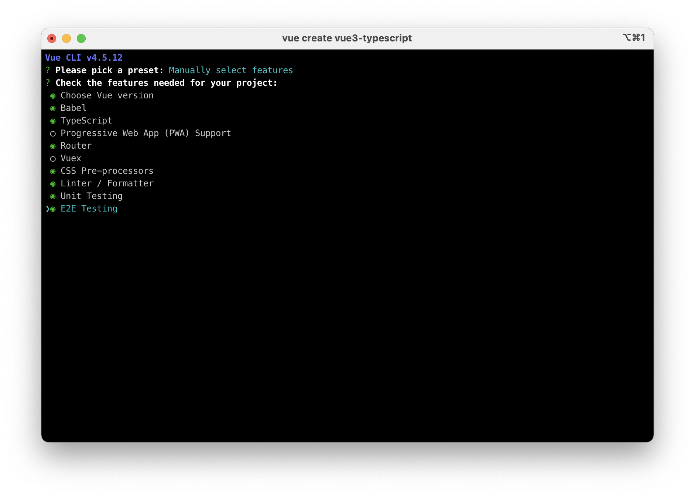
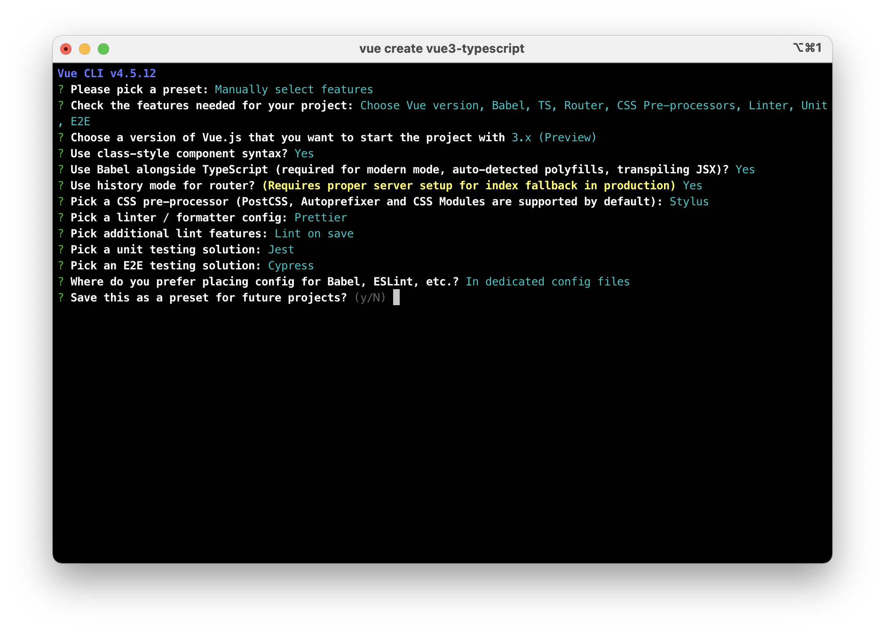
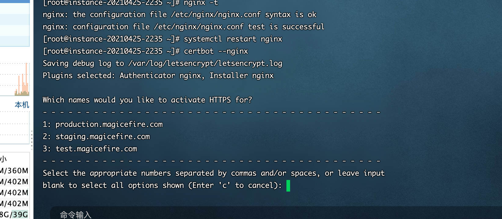
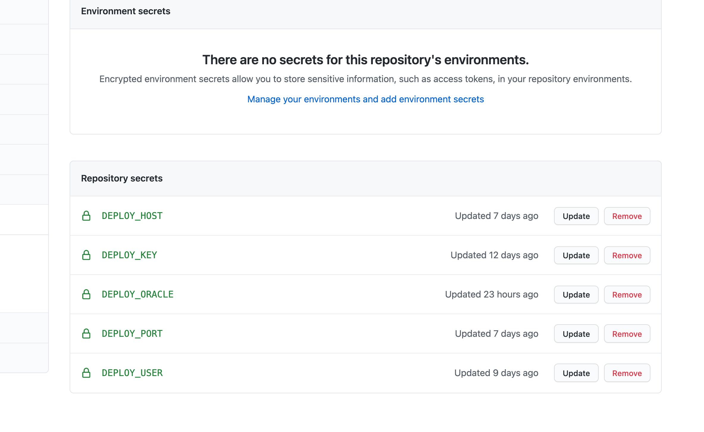
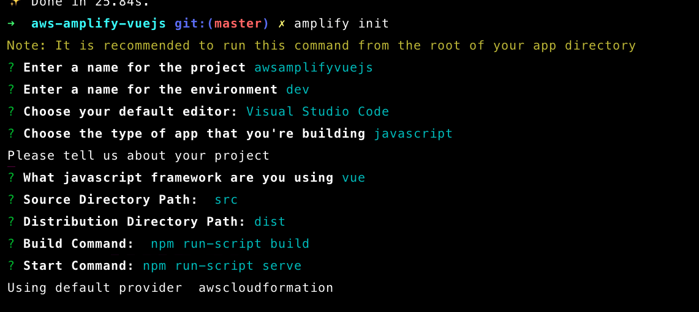
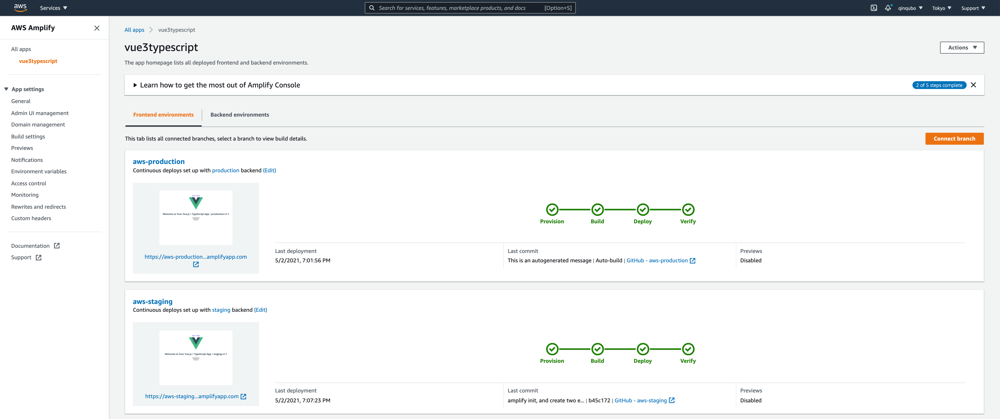
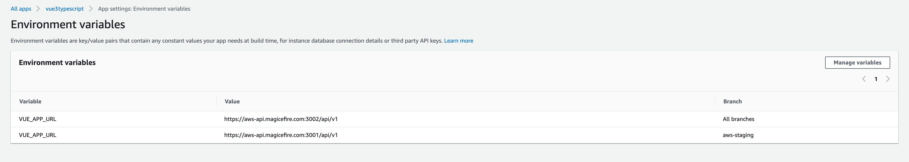
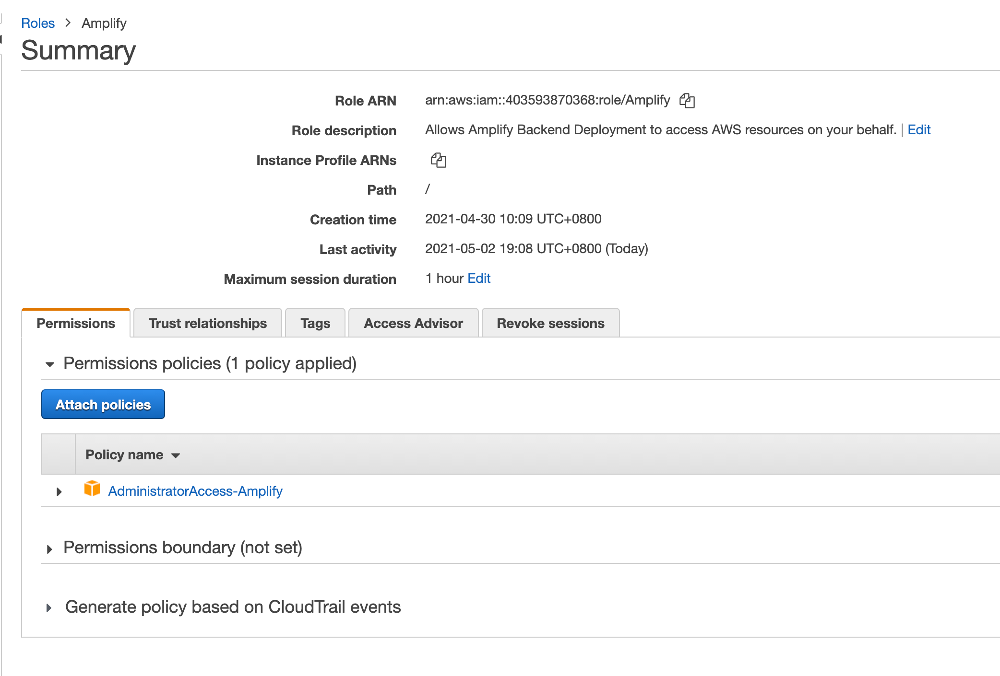

# # 基于 Typescript 的全栈工程模版 - 前端 Vue3

## Project setup

```
npm install
```

### Compiles and hot-reloads for development

```
npm run serve
```

### Compiles and minifies for production

```
npm run build
```

### Run your unit tests

```
npm run test:unit
```

### Run your end-to-end tests

```
npm run test:e2e
```

### Lints and fixes files

```
npm run lint
```

### Customize configuration

See [Configuration Reference](https://cli.vuejs.org/config/).

## 用命令行 vue-cli 创建 vue3 的应用框架

1. 安装或更新 vue-cli

```shell
npm install -g @vue/cli
```

或

```shell
npm update -g @vue/cli
```

2. 创建应用

- 
- 

### Lint

1. 添加 .prettierrc.js 文件

```javascript
module.exports = {
  tabWidth: 2,
  semi: false,
  singleQuote: true,
  trailingComma: 'all',
}
```

2. 修改 workspace 的配置, ** 一定要重新打开 vscode **

```json
{
  "editor.formatOnSave": false,
  "editor.codeActionsOnSave": {
    "source.fixAll.eslint": true
  }
}
```

3. 运行 npm run lint

## 编译打包确认环境变量

1. Mode 的概念
   Mode is an important concept in Vue CLI projects. By default, there are three modes:

- development is used by vue-cli-service serve
- test is used by vue-cli-service test:unit
- production is used by vue-cli-service build and vue-cli-service test:e2e

You can overwrite the default mode used for a command by passing the --mode option flag. For example, if you want to use development variables in the build command:

```json
  "scripts": {
    "dev": "vue-cli-service serve",
    "test": "vue-cli-service serve --https --mode mytest",
    "staging": "vue-cli-service build --mode staging",
```

2. mode 决定了打包用哪个环境变量文件

```
.env                # loaded in all cases
.env.local          # loaded in all cases, ignored by git
.env.[mode]         # only loaded in specified mode
.env.[mode].local   # only loaded in specified mode, ignored by git
```

In addition to VUE*APP*\* variables, there are also two special variables that will always be available in your app code:

- NODE_ENV - this will be one of "development", "production" or "test" depending on the mode the app is running in.
- BASE_URL - this corresponds to the publicPath option in vue.config.js and is the base path your app is deployed at.
- 环境变量文件中可以再申明 NODE_ENV, 例如在 .env.staging 中设置 ** NODE_ENV=production **, 确认打包时可以优化 staging 下的代码

## 搭建持续集成和持续部署环境

### 部署到 Oracle CentOS 8 服务器中的 Nginx 下

1. 配置 Nginx 支持单个端口对应多个二级域名的静态服务

- 编辑 /etc/nginx/nginx.conf 支持同一个端口，不同的静态服务器

```
server {
    listen  80;
    server_name     test.magicefire.com;
    root            /usr/share/nginx/html/test;
    location / {}
}

server {
    listen  80;
    server_name     staging.magicefire.com;
    root            /usr/share/nginx/html/staging;
    location / {}
}

server {
    listen  80;
    server_name     production.magicefire.com;
    root            /usr/share/nginx/html/production;
    location / {}
}
```

建立对应的目录，在目录下放测试 html

- 修改 Cloudflare，添加三条 A 记录，支持 VPS 的 IP
  

- 通过 Let's Encrypt 修改 nginx 的 https 支持
  安装 certbot 见 Node Server 的部署

```shell
certbot -nginx
```

 2. 编写 Github Actions 部署脚本

2. 在 .github/workflows 下添加 Github Actions
   **注意不要添加 NODE_ENV=production，设置了这个后 npm ci 不会 install devDependencies 下的模块，会导致 npm run build 报错无法找到 vue-cli-service**
   **Vue 的 Webpack 会根据 --mode [staging | production ] 找到对应的 .env.\* 文件， 在这些中再声明 NODE_ENV=production**

3. 在 Github 的仓库设置中，给 Actions 用到的添加加密的 Secrets
   
   **DEPLOY_ORACLE=/usr/share/nginx/html**

### 部署到 Heroku

1. 创建 staging 和 production 两个独立的 APP
   与服务端部署不一样，两个环境都是在 Webpack 打包时注入了环境变量，两个环境都需要走 CI 的编译打包流程，所以通过 Pipeline 的 Promote 是没有意义的。我们这里创建两个独立的 APP：[staging-vue3, production-vue3]
2. 为每个 APP 添加编辑插件, 因为是静态部署，比 Node
   Server 多了一个插件

```shell
heroku buildpacks:add heroku/nodejs
heroku buildpacks:add https://github.com/heroku/heroku-buildpack-static
```

并且要添加 static.json 文件在项目的根目录下

```json
{
  "root": "dist",
  "clean_urls": true,
  "routes": {
    "/**": "index.html"
  }
}
```

3. 在两个 APP 的设置中绑定关联的 Github 仓库和分支
   这里的 VUE_APP_URL 是在 **编译** 时候，覆盖 axios 默认的 BASE_URL，指向对应的 Node Server，不同的分支也可以有不同的 Value
   **与 Amplify 不同这里要设置 NODE_ENV=production，设置了这个后 npm ci 不会影响 install devDependencies 下的模块**

### 通过 Amplify 部署到 Amazon EC2

#### 通过 amplify init 创建 Amplify 应用，并初始化对应的 Backend

1. 通过命令行在项目的根目录下创建 Amplify 的应用, 命名 `vue3typescript`

```shell
amplify init
```



2. 同时创建了一个后端环境，先命名为 `staging`
3. 进入 AWS Console， 到 Amplify 下，进入刚才创建的 `vue3typescript APP`。连接 Github 仓库和对应的 aws-staging 分支。并在关联的后端服务上选择 `staging`
4. 连接 Github 仓库和对应的 aws-production 分支。通过 Amplify 命令行创建一个新的后端环境 `production`

```shell
amplify env add
```

然后在 Amplify 后台的 aws-production 前端环境绑定 `production`


#### 创建 amplify.yaml 文件，修改 build 的脚本

```yml
version: 0.2
backend:
  phases:
    build:
      commands:
        - '# Execute Amplify CLI with the helper script'
        - amplifyPush --simple
frontend:
  phases:
    preBuild:
      commands:
        - npm ci
    build:
      commands:
        - nvm use $VERSION_NODE_10
        - node -v
        - if [ "${AWS_BRANCH}" = "aws-staging" ]; then echo "staging branch" && npm run build:staging; elif [ "${AWS_BRANCH}" = "aws-production" ]; then echo "production branch" && npm run build:production; else echo "test branch" && npm run build:mytest; fi
  artifacts:
    baseDirectory: dist
    files:
      - '**/*'
  cache:
    paths:
      - node_modules/**/*
```

当推送到对应的分支后，Amplify 会调用这个脚本执行编译，打包和部署

#### 设置环境相关的变量


这里的 VUE_APP_URL 是在 **编译** 时候，覆盖 axios 默认的 BASE_URL，指向对应的 Node Server，不同的分支也可以有不同的 Value
**注意不要添加 NODE_ENV=production，设置了这个后 npm ci 不会 install devDependencies 下的模块，会导致 npm run build 报错无法找到 vue-cli-service**
**Vue 的 Webpack 会根据 --mode [staging | production ] 找到对应的 .env.\* 文件， 在这些中再声明 NODE_ENV=production**

#### 创建 Amplify 角色

**创建 Amplify APP 时，好像没有自动创建关联的 Role**, 我手动创建了一个

